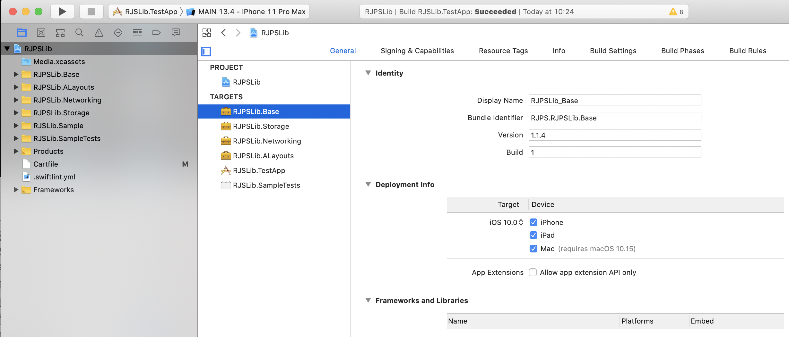

# RJPSLib

__Guys love tools, this is my Swift toolbox__

<p align="center">
   <a href="https://developer.apple.com/swift/">
      
   </a>
    <a href="https://developer.apple.com/swift/">
      
   </a>
   <a href="">
      
   </a>
   <br/>
   <a href="https://github.com/Carthage/Carthage">
      
   </a>
   <a href="https://github.com/apple/swift-package-manager">
      
   </a>
   <a href="https://twitter.com/ricardo_psantos/">
      
   </a>
</p>

---
# Inside

There are 4 frameworks separated by business 



## RJPSLib.Base

* Extensions
* Reachability manager
* App and device info utilities
* Generic utilities 
   * Cronometer
   * App Logger
   * Data types conversion tools
* Util classes
   * `SynchronizedArray`
* Others

## RJPSLib.ALayouts

Auto-layout framework (supports constraints or anchors)

```swift
let label = UILabel()
let imageView = UIImageView()
self.view.addSubview(label)
self.view.addSubview(imageView)

label.rjsALayouts.setMargin(50, on: .top)
label.rjsALayouts.setMargin(50, on: .left)
label.rjsALayouts.setHeight(50)

imageView.rjsALayouts.setMargin(50, on: .top)
imageView.rjsALayouts.setMargin(50, on: .left, from: label)
imageView.rjsALayouts.setHeight(50)
```

## RJPSLib.Networking

Simple network clients

## RJPSLib.Storage

Storage helpers for

* File manager
* CoreData
* Keychain
* NSUserDefaults
* Caching 
   * Live cache using NSCache
   * Persistent cache using CoreData

# Install

**Carthage**

[Carthage](https://github.com/Carthage/Carthage) is a decentralized dependency manager that builds your dependencies and provides you with binary frameworks.

You can install Carthage with [Homebrew](http://brew.sh/) using the following command:

```bash
$ brew update
$ brew install carthage
```

To integrate RJPSLib into your Xcode project using Carthage, specify it in your `Cartfile`:

```ogdl
github "ricardopsantos/RJPSLib" "1.1.4"
```

or for beta

```ogdl
github "ricardopsantos/RJPSLib"
```

* Run `carthage update` to build the framework
* Drag the built `RJPSLib.framework` into your Xcode project
* Add o run script on _Build phases_ with `$(SRCROOT)/Carthage/Build/iOS/RxSwift.framework`


