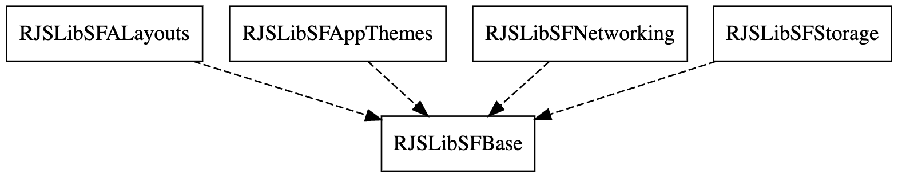
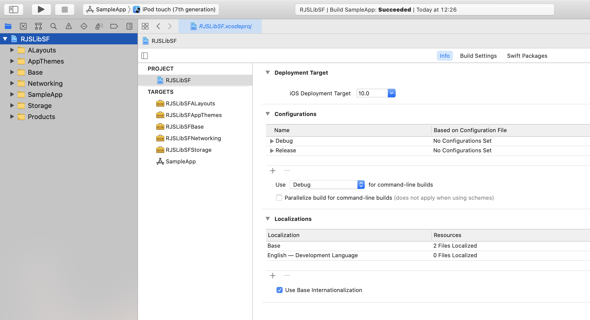

# RJSLibUF

__Guys love tools, this is my Swift toolbox (UIKit and Foundation )__

<p align="center">
   <a href="https://developer.apple.com/swift/">
      
   </a>
    <a href="https://developer.apple.com/swift/">
      
   </a>
   <a href="">
      
   </a>
   <br/>
   <a href="https://github.com/Carthage/Carthage">
      
   </a>
   <a href="https://github.com/apple/swift-package-manager">
      
   </a>
   <a href="https://twitter.com/ricardo_psantos/">
      
   </a>
</p>

---
# Inside

There are 5 frameworks separated by business 





## Base

* Extensions
* Reachability manager
* App and device info utilities
* Generic utilities 
   * Chronometer
   * App Logger
   * Data types conversion tools
* Util classes
   * `SynchronizedArray`
* Others

## AppThemes

_To do..._

## ALayouts

Auto-layout framework (supports constraints or anchors)

```swift
let label = UILabel()
let imageView = UIImageView()
self.view.addSubview(label)
self.view.addSubview(imageView)

label.rjsALayouts.setMargin(50, on: .top)
label.rjsALayouts.setMargin(50, on: .left)
label.rjsALayouts.setHeight(50)

imageView.rjsALayouts.setMargin(50, on: .top)
imageView.rjsALayouts.setMargin(50, on: .left, from: label)
imageView.rjsALayouts.setHeight(50)
```

## Networking

Model

```swift
struct Employee: Codable {
    let identifier, employeeName, employeeSalary: String
    enum CodingKeys: String, CodingKey {
        case identifier     = "id"
        case employeeName   = "employee_name"
        case employeeSalary = "employee_salary"
    }
}
```

API Target Request
```swift
struct EmployesAPIRequest: RJS_SimpleNetworkClientProtocol {
    var returnOnMainTread: Bool = false
    var debugRequest: Bool = true
    var urlRequest: URLRequest
    var responseType: RJS_SimpleNetworkClientResponseType
    var mockedData: String? = """
[{"id":"36253","employee_name":"Mike Cooper","employee_salary":"80"},{"id":"36255","employee_name":"Eldon","employee_salary":"9452"}]
"""
    init() throws {
        if let url = URL(string: "http://dummy.restapiexample.com/api/v1/employees") {
            urlRequest            = URLRequest(url: url)
            urlRequest.httpMethod = RJS_SimpleNetworkClient.HttpMethod.get.rawValue
            responseType          = .json
        } else {
            throw NSError(domain: "com.example.error", code: 0, userInfo: nil)
        }
    }
}
```

Request

```swift
do {
    let apiRequest: RJS_SimpleNetworkClientProtocol = try EmployesAPIRequest()
    let api: RJS_SimpleNetworkClientRequestProtocol = RJS_SimpleNetworkClient()
    api.execute(request: apiRequest, completionHandler: { (result: Result<RJS_SimpleNetworkClientResponse<[Employee]>>) in
        switch result {
        case .success(let some):
            print(some.entity)
        case .failure(let error):
            print(error)
        }
    })
} catch {
    print(error)
}
```

## Storage

Storage helpers for

* File handling
* CoreData
* Keychain
* NSUserDefaults
* Caching 
   * Live cache using NSCache
   * Persistent cache using CoreData

# Install

**Carthage**

[Carthage](https://github.com/Carthage/Carthage) is a decentralized dependency manager that builds your dependencies and provides you with binary frameworks.

You can install Carthage with [Homebrew](http://brew.sh/) using the following command:

```bash
$ brew update
$ brew install carthage
```

To integrate RJPSLib into your Xcode project using Carthage, specify it in your `Cartfile`:

```ogdl
github "ricardopsantos/RJSLibUF" "1.0"
```

or for beta

```ogdl
github "ricardopsantos/RJSLibUF"
```


