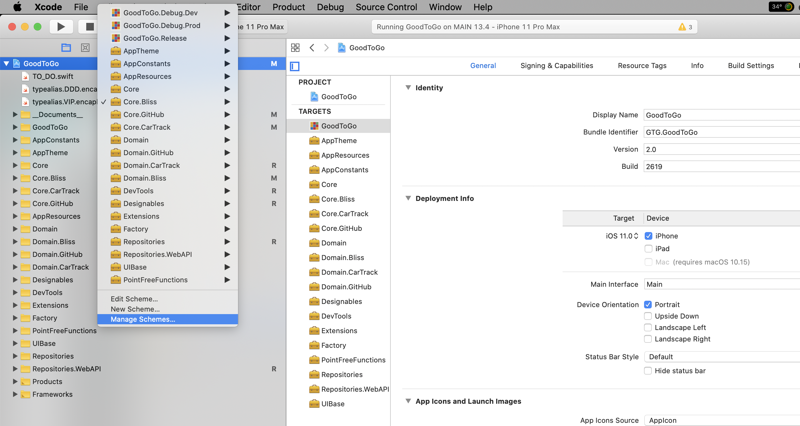
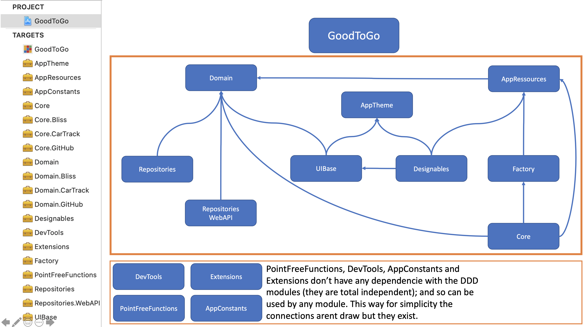

# iOS Architecture design patterns : (MVP or VIP) + Clean + Rx

- [x] 📱  iOS 11.0+
- [x] 🔨  XCode 11.4, Swift 5.1

The intent of this project is to show a simple implementation of the __MVP/VIP + Clean (Rx)__ pattern. This is my vision about it, and if you don't agree with something, just email me, I love to hear opinions and learn from that.

## Project structure

## Project modules dependencies

# Install

Just download source code and run  `./_script_installPackages.sh`

# Features

- [x] Localisable ressources
- [x] [RJPSLib](https://github.com/ricardopsantos/RJPSLib) to manage logs, caching, network client, generic extensions...
- [x] RxSwift & RxCocoa usage
- [x] [.xcconfig](https://nshipster.com/xcconfig/) usage
- [x] Cache (on Network API) usage
- [x] Code style analyser with [Swiftlint](https://github.com/realm/SwiftLint)
- [x] Dependency injection with [Swinject](https://github.com/Swinject/Swinject)
- [x] MVP Pattern design sample screens - `GoodToGo/Scenes/AppScenes.MVP`
- [x] VIP Pattern design sample screens - `GoodToGo/Scenes/AppScenes.VIP`
- [x] VIP Custom Xcode Template (`GoodToGoVIP_Schene.xctemplate`)

More info about the project and MVP architecture [here](https://github.com/ricardopsantos/RJPS_MVPCleanRx/tree/master/Docs)
 
# Used Frameworks

 * [RJPSLib](https://github.com/ricardopsantos/RJPSLib) - Swift toolbox
 * [TinyConstraints](https://github.com/roberthein/TinyConstraints) - Nothing but sugar.
 * [Swinject](https://github.com/Swinject/Swinject) - Dependency injection framework for Swift with iOS/macOS/Linux
 * [NSLogger](https://github.com/fpillet/NSLogger) - A modern, flexible logging tool
 * RxDataSources, RxSwift, RxGesture, RxCocoa
 * [Toast-Swift](https://github.com/scalessec/Toast-Swift) - A modern, flexible logging tool
 * [SkyFloatingLabelTextField](https://github.com/Skyscanner/SkyFloatingLabelTextField) - A beautiful and flexible text field control implementation of _Float Label Pattern_
 * [Hero](https://github.com/HeroTransitions/Hero) - Elegant transition library for iOS & tvOS
 * [Material](https://github.com/CosmicMind/Material) - A UI/UX framework for creating beautiful applications. http://cosmicmind.com
 * [Motion](https://github.com/CosmicMind/Motion) - A library used to create beautiful animations and transitions for iOS. 
 * [Lottie-ios](https://github.com/airbnb/lottie-ios) - An iOS library to natively render After Effects vector animations
 
# Code Guidelines/Conventions

* All is private (variables, functions, etc), unless really need to be public.
* UIKit names
    * All `UIButton`s start by _btn_, example : _btnLogin_, _btnRegister_
    * All `UILabel`s start by _lbl_. Example _llbName_, _lblPassword_
    * All `UITableView`s start by _table_ or _tbl_. Example : _tableUsers_, _tblFriends_
    * All `UITextViews` and `UITextField`s starts by _txt_. Example : _txtPassword_, _txtUserName_
    * All Rx related vars start with `rx` or end with `Single`, `Observable`, etc...
    * Thumb rule : The name of the _var_, should be clear about the type associated. 
    

# License

[Unlicense](http://unlicense.org)

What is the Unlicensed?
The Unlicense is a template for disclaiming copyright monopoly interest in software you've written; in other words, it is a template for dedicating your software to the public domain. It combines a copyright waiver patterned after the very successful public domain SQLite project with the no-warranty statement from the widely-used MIT/X11 license.
