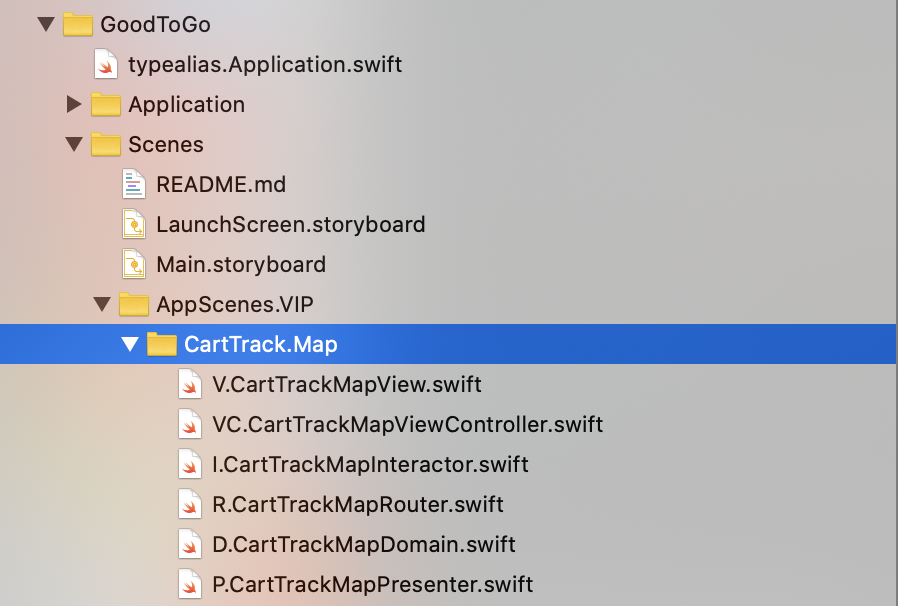

<p align="center">
   <a href="https://developer.apple.com/swift/">
      
   </a>
    <a href="https://developer.apple.com/swift/">
      
   </a>
   <a href="">
      
   </a>
   <a href="https://twitter.com/ricardo_psantos/">
      
   </a>
</p>


# iOS Architecture design patterns : (MVP or VIP) + Clean + Rx

The mains intent of this project is:

* To show a implementation of my 2 favorites design patterns: __MVP + Clean (Rx)__ and __MVP + Clean (Rx)__ and how we can use booth at same time and still have a rock solid project. 

* Have a quick start project with all that a good project have (logs, webapi, etc), and that usually take some days to configure if we start from scratch. Saying so _Good to Go_ looked like a good name to me.

If you don't agree with something or have a sugestion, just email me, I love to hear opinions and learn from that.

# Install

Just download source code and run  `./_script_installPackages.sh`

This will install/update [Brew](https://brew.sh/), that will be used to install/update [Carthage](https://github.com/Carthage/Carthage)

## Project structure


The project follows the Domain Driven aproach, and its divided in frameworks acording to business.

About namings, and taking `Core` as example. `Core` is where we have the __base__ implementation of business for the app; and this `Core` is something that could be in every mobile app. But `Core.XXX` do the same type of  of special business logic applyed to this app alone.  

This mean that if we want to take out the `XXX` logic from the project, we just need to delete `Core.XXX`, `Domain.Bliss` and the Screens / `UIViewController`'s.

## Project modules dependencies


* `GoodToGo` : Is the app it self. ViewContollers and SwiftInject related code
* `AppTheme` : Manage fonts, colors and so so
* `AppConstants` : Constantes
* `Designables` : UI components
* `Factory` : Factory for objects (for now just `Errors`)
* `AppResources` : App strings/localizables, images, etc...
* `UIBase` : Base clases, mainly for `MVP` and `VIP`
* `Domain`, `Core`, `Repositories` : DDD
* `DevTools` : Logs, feature flags, develper helping tools in general
* `Extensions` : See [Extensions](https://docs.swift.org/swift-book/LanguageGuide/Extensions.html)
* `PointFreeFunctions` : Small global var/functions like

 ```
 public var screenWidth: CGFloat { return UIScreen.main.bounds.width }
 ```


# Project (implemented) Features

- [x] Localizable resources
- [x] Remote logs with [NSLogger](https://github.com/fpillet/NSLogger)
- [x] [RJPSLib](https://github.com/ricardopsantos/RJPSLib) to manage logs, caching, network client, generic extensions...
- [x] RxSwift & RxCocoa usage
- [x] [.xcconfig](https://nshipster.com/xcconfig/) usage
- [x] Cache (on Network API) usage
- [x] Code style analyser with [Swiftlint](https://github.com/realm/SwiftLint)
- [x] Dependency injection with [Swinject](https://github.com/Swinject/Swinject)
- [x] MVP Pattern design sample screens - `GoodToGo/Scenes/MVP.*`
- [x] VIP Pattern design sample screens - `GoodToGo/Scenes/VIP.*`
- [x] VIP Custom Xcode Template - `GoodToGoVIP_Schene.xctemplate`
- [x] UnitTests
- [x] `SwiftUI` Preview for all `UIViewControllers`

More info about the project and MVP|VIP architecture [here](https://github.com/ricardopsantos/RJPS_MVPCleanRx/tree/master/__Documents__/Arquitecture)
 
# Used Frameworks

 * [RJPSLib](https://github.com/ricardopsantos/RJPSLib) - Swift toolbox
 * [TinyConstraints](https://github.com/roberthein/TinyConstraints) - Nothing but sugar.
 * [Swinject](https://github.com/Swinject/Swinject) - Dependency injection framework for Swift with iOS/macOS/Linux
 * [NSLogger](https://github.com/fpillet/NSLogger) - A modern, flexible logging tool
 * RxDataSources, RxSwift, RxGesture, RxCocoa
 * [Toast-Swift](https://github.com/scalessec/Toast-Swift) - A modern, flexible logging tool
 * [SkyFloatingLabelTextField](https://github.com/Skyscanner/SkyFloatingLabelTextField) - A beautiful and flexible text field control implementation of _Float Label Pattern_
 * [Hero](https://github.com/HeroTransitions/Hero) - Elegant transition library for iOS & tvOS
 * [Material](https://github.com/CosmicMind/Material) - A UI/UX framework for creating beautiful applications. http://cosmicmind.com
 * [Motion](https://github.com/CosmicMind/Motion) - A library used to create beautiful animations and transitions for iOS. 
 * [Lottie-ios](https://github.com/airbnb/lottie-ios) - An iOS library to natively render After Effects vector animations
 * [Pulsator](https://github.com/shu223/Pulsator/) - Pulse animation for iOS

# Code Guidelines/Conventions

## All is private

Variables, functions, etc are private, unless really need to be public/internal

## Variable naming

* All `UIButton`s start by _btn_. Example : _btnLogin_, _btnRegister_
* All `UILabel`s start by _lbl_. Example _llbName_, _lblPassword_
* All `UITableView`s start by _table_ or _tbl_. Example : _tableUsers_, _tblFriends_
* All `UITextViews` and `UITextField`s starts by _txt_. Example : _txtPassword_, _txtUserName_
* All Rx related vars start with `rx` or end with `Single`, `Observable`, etc...

__Thumb rule : The name of the var, should be clear about the type associated.__

## Files naming

### Enums 

All enum file names start by ` E.`.

```
public enum AlertType: CaseIterable {
    case success
    case warning
    case error
}
```

So, the `AlertType` will be found on a file name `E.AlertType.swift`
 
### VIP, MVP

The _Views_ will start allways by `V.`, _ViewControlles_ by `VC.`, Router by `R.`, _Interactors_ by `I.`, Presenters by `P.` and Domain file by `D.` 



## Others

* Hardcoded values are strongly discouraged

# License

[Unlicense](http://unlicense.org)

What is the Unlicensed?
The Unlicense is a template for disclaiming copyright monopoly interest in software you've written; in other words, it is a template for dedicating your software to the public domain. It combines a copyright waiver patterned after the very successful public domain SQLite project with the no-warranty statement from the widely-used MIT/X11 license.
