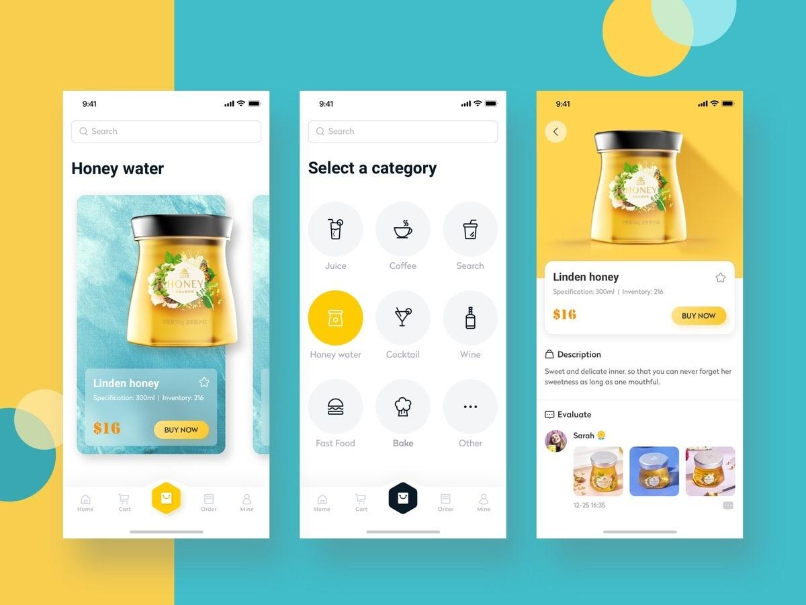
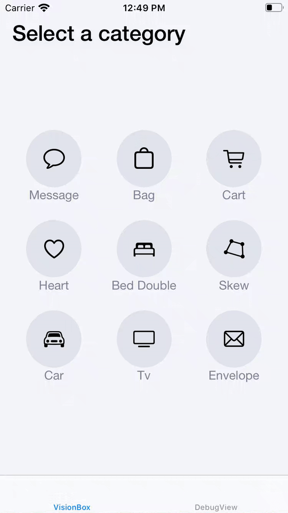
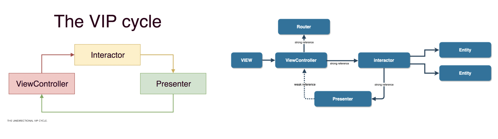
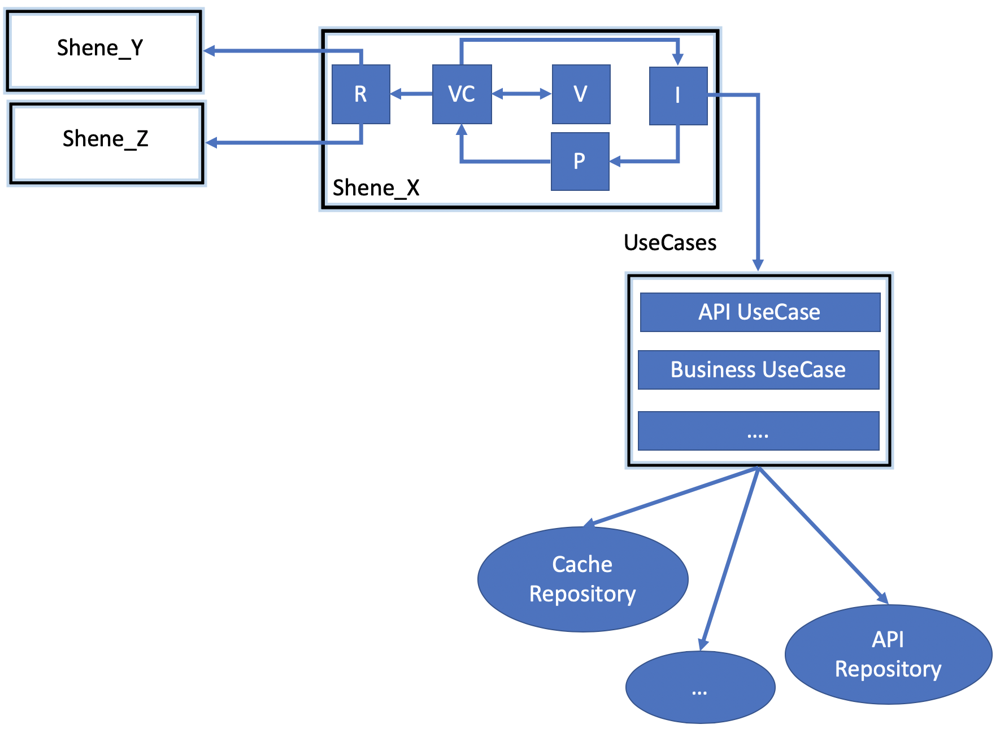
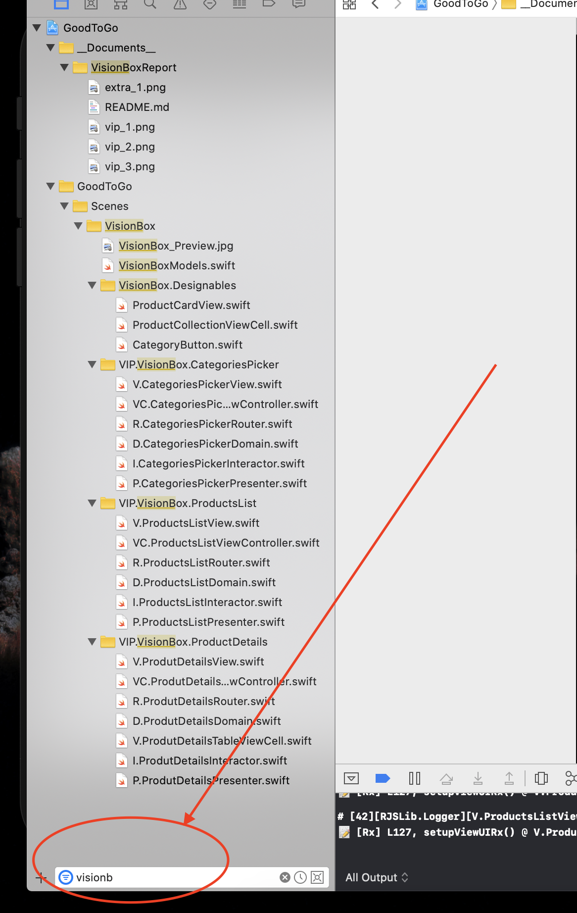

# Install Requirements

To install just download source code and run  `./_script_installPackages.sh`

Requires iOS 11.0+ and XCode 11.1, Swift 5.1

---

# Exercise

As an exercise to test your technical skills we would like you to reproduce the attached design in iOS.

• You will have two days to do this task.
• Please send us a zipped file with the final code once you've finished.
• You are free to write the code in any manner you see fit and to the best of your abilities.
• The functionality between views is up to you, make it as simple or as complex as you see fit.

---

# Result Preview

# Design Pattern

---

# Design Pattern

[VIP - Clean Swift Architecture](https://medium.com/crazy-minds/vip-clean-swift-architecture-in-ios-bb1d71680542)

## About app architecture with VIP

All the connections are _protocols/interfaces_

* Each `Scene` is usually and app screen.
* Each `Scene` have at least a `View`, a `ViewController`, a `Presenter`, a `Router` and a `Interactor`
* `ViewController` aka `VC`, is the glue between the `View` and the `Interactor`. `VC` will forward user interactions and "business" question to the `Interator`, and will be responsible for the business of a `VC`. 
* `Interactor` knows the `Use Cases` aka `UC`, and they are the real brain or the app. `Interactor` forward the `UC` responses to the `Presenter`
* `Presenter` aka `P`, will parse the response from the `Interactor` in way the `VC` can read. After the parsing, the `Presenter` forward the ` Interactor` response to the `VC`.
* `VC` know the `View` aka ` V` (UIView), and the `View` have all the UI elements __(they are not in the ViewController)__
* `VC` also knows the `Router` as aka `R`
* `Router` is responsible for the navigation between different `VC`s

* `Repositories`, aka `RP` are a “source” of data. They can be a Cache, a DataBase, the API, etc.
* `UseCases` are the brain of the app, and each one will know one or more `RP`

### Others

* Code style analyser with [Swiftlint](https://github.com/realm/SwiftLint)

* Dependency injection with [Swinject](https://github.com/Swinject/Swinject) (See `RootAssemblyContainer.swift` file)

* Multi language support prepared  (see `E.Messages.swift` file)

* Its easier to find the exam related files inside the project (that have a lot os architecture and helper files) by searching _VisionBox_ on Xcode

