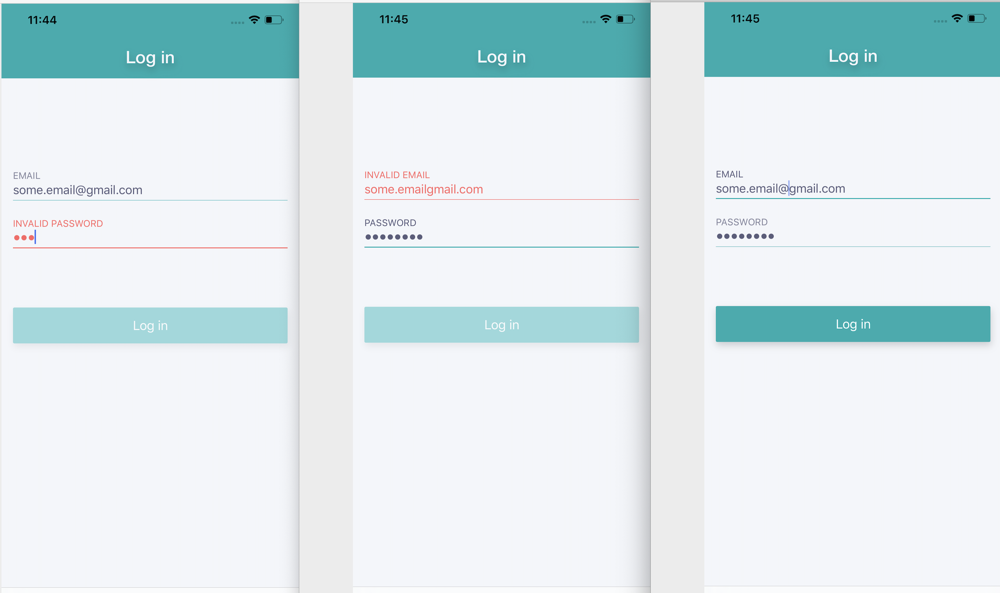
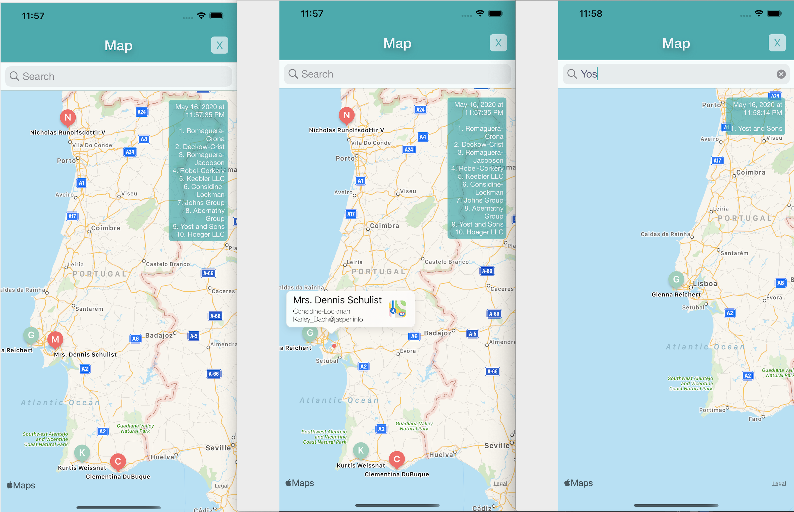
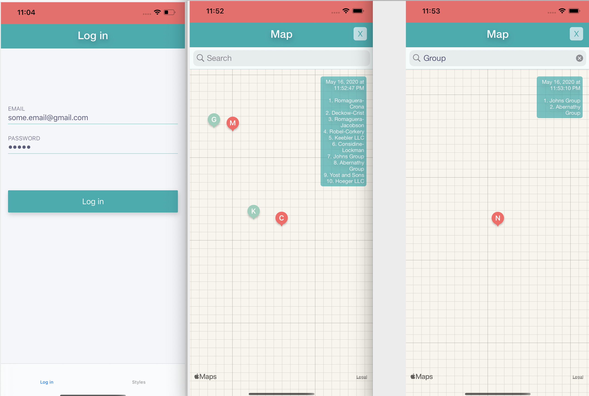
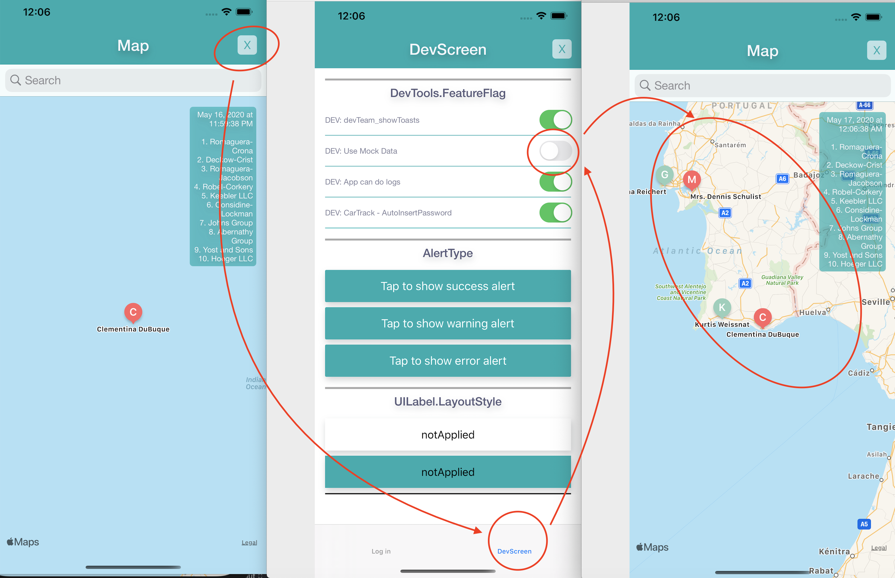
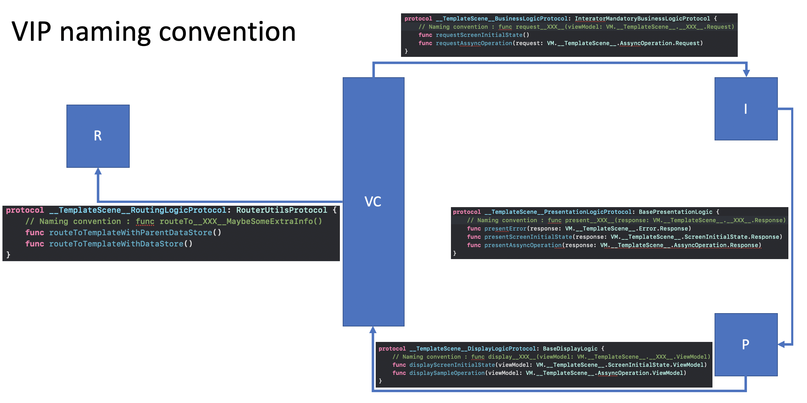
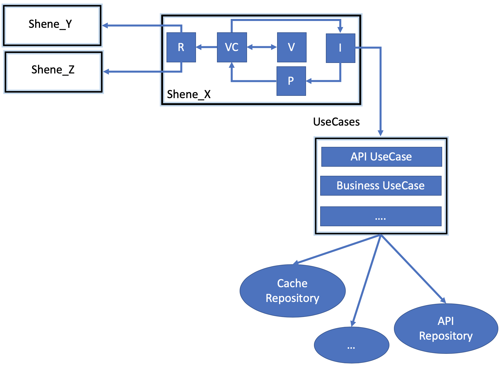
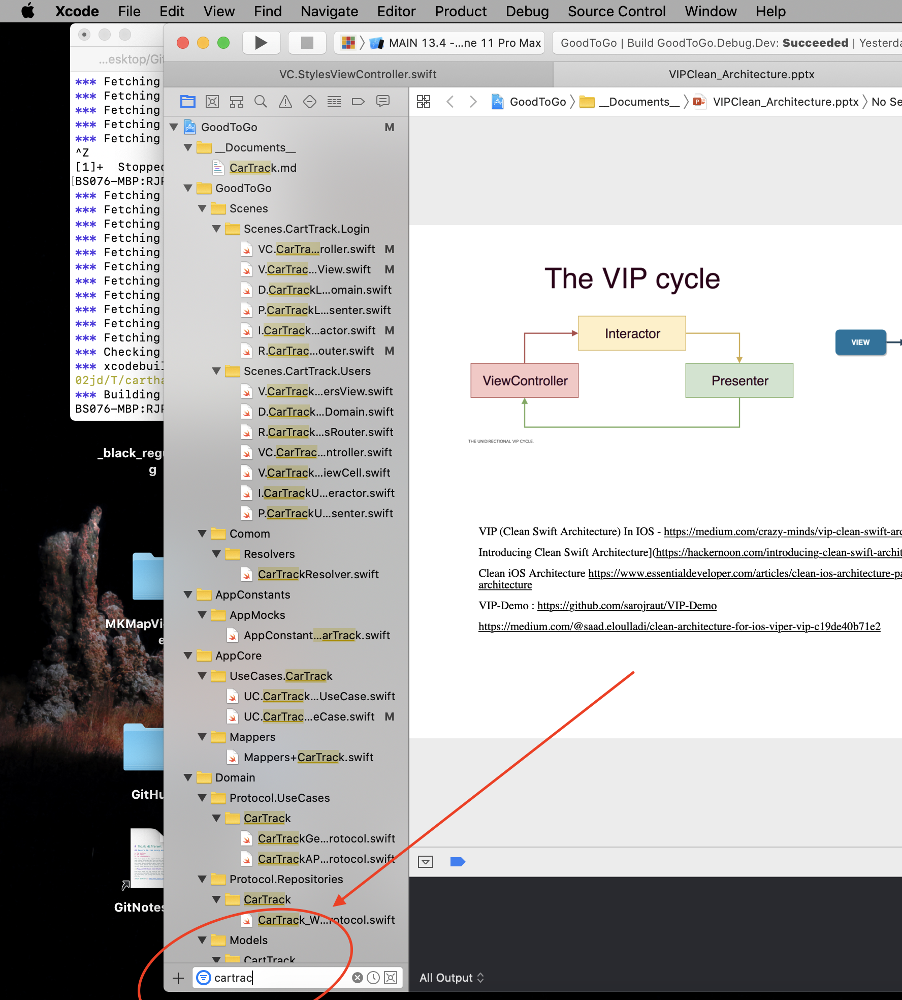

# Requirements

To install just download source code and run  `./_script_installPackages.sh`

Requires iOS 11.0+ and XCode 11.1, Swift 5.1

---

# Features

## Login

Only after a valid email address is entered, and a password with at least 5 chars, will unlock the login button. 

Any email can be used to unlock the app, but the password __MUST__ be `12345`

## Map

The map allows tap and filter.

## Extra : Cache Suport

To avoid the user waiting for a server response, the API calls are cached in a local data base.

What happens is : the user have to wait for a server response for the first time __only__. After the  after that the app will use the cache version of the API, show it to the user; then the app will fetch the latest server version and update the screen again with the latest values.

## Extra : No Internet Connection

If theres no internet connection, a red bar will appear automatically on the top (and disappear automatically again) when the connection returns

__Because the app have a cache system integrated, we are able the use the app with out internet connection__. The map it self will no appear, but the data on it will appear. 

## Extra : Mock data

The server data had inaccurate information (some of the coordinates were on the sea). For a better developing experience and testing; the application can use [mock data](https://en.wikipedia.org/wiki/Mock_object). The enable the [mock data](https://en.wikipedia.org/wiki/Mock_object) close the map, then go to the second screen (a developer screen) and switch __on__ the _Mock Data_ option. Going now to the map, it will have more friendly information. The mock file is `
AppConstants+Mock+CarTrack.swift`

---

# Design Pattern

[VIP - Clean Swift Architecture](https://medium.com/crazy-minds/vip-clean-swift-architecture-in-ios-bb1d71680542)

## About app architecture with VIP

All the connections are _protocols/interfaces_

* Each `Scene` is usually and app screen.
* Each `Scene` have at least a `View`, a `ViewController`, a `Presenter`, a `Router` and a `Interactor`
* `ViewController` aka `VC`, is the glue between the `View` and the `Interactor`. `VC` will forward user interactions and "business" question to the `Interator`, and will be responsible for the business of a `VC`. 
* `Interactor` knows the `Use Cases` aka `UC`, and they are the real brain or the app. `Interactor` forward the `UC` responses to the `Presenter`
* `Presenter` aka `P`, will parse the response from the `Interactor` in way the `VC` can read. After the parsing, the `Presenter` forward the ` Interactor` response to the `VC`.
* `VC` know the `View` aka ` V` (UIView), and the `View` have all the UI elements __(they are not in the ViewController)__
* `VC` also knows the `Router` as aka `R`
* `Router` is responsible for the navigation between different `VC`s

* `Repositories`, aka `RP` are a “source” of data. They can be a Cache, a DataBase, the API, etc.
* `UseCases` are the brain of the app, and each one will know one or more `RP`

### Others

* Code style analyser with [Swiftlint](https://github.com/realm/SwiftLint)

* Dependency injection with [Swinject](https://github.com/Swinject/Swinject) (See `RootAssemblyContainer.swift` file)

* Multi language support prepared  (see `E.Messages.swift` file)

* Its easier to find the exam related files inside the project (that have a lot os architecture and helper files) by searching _cartrack_ on Xcode

