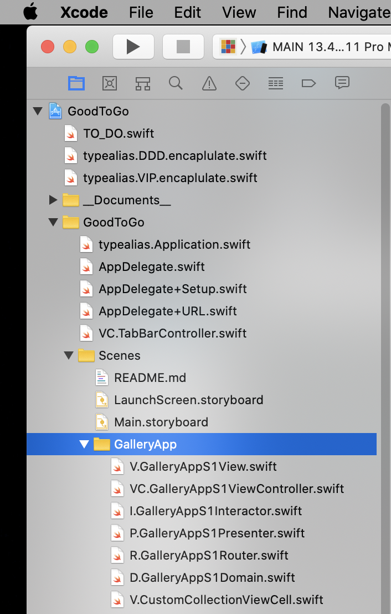
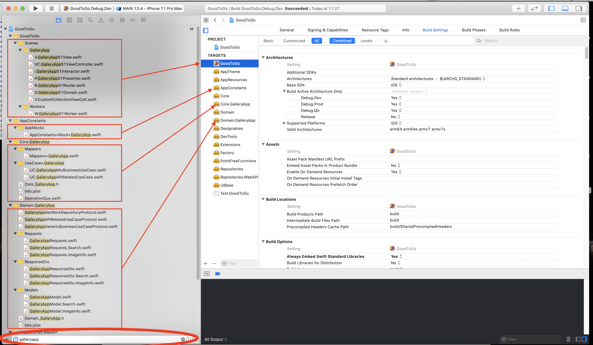
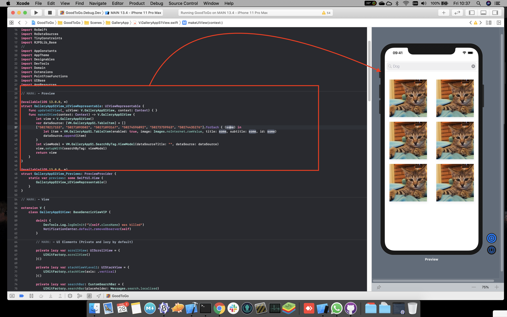
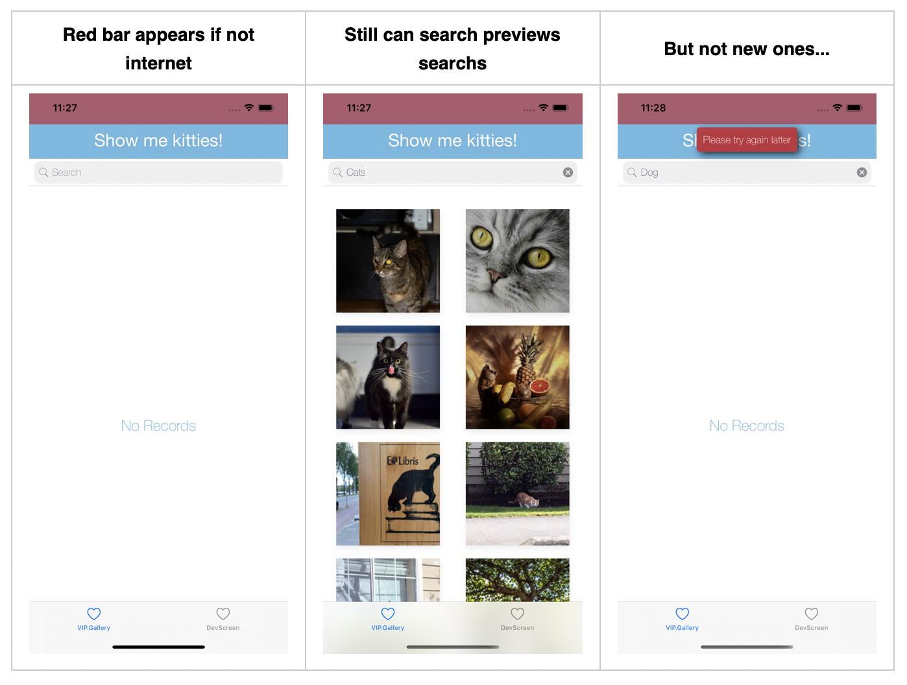
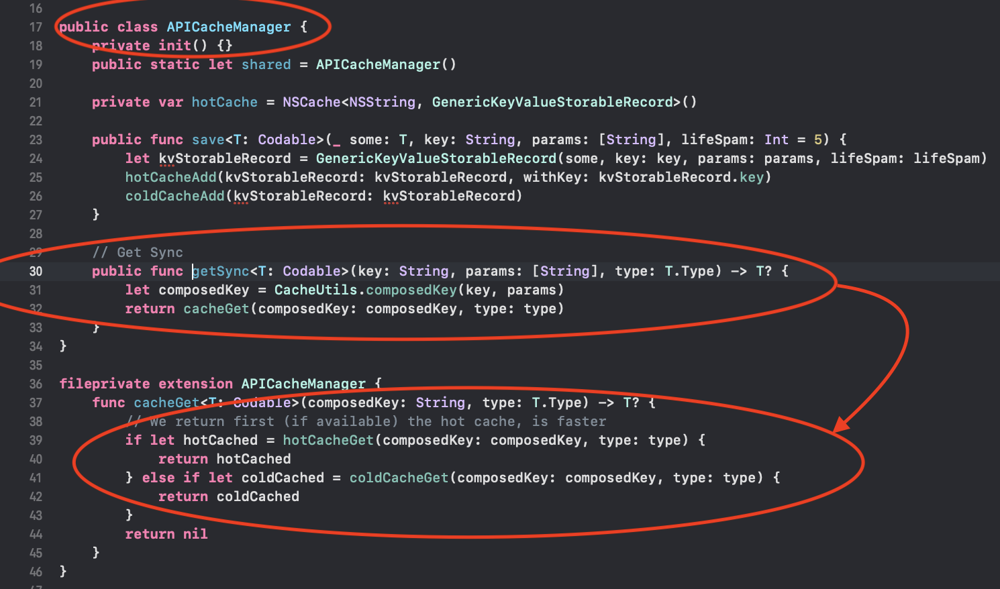
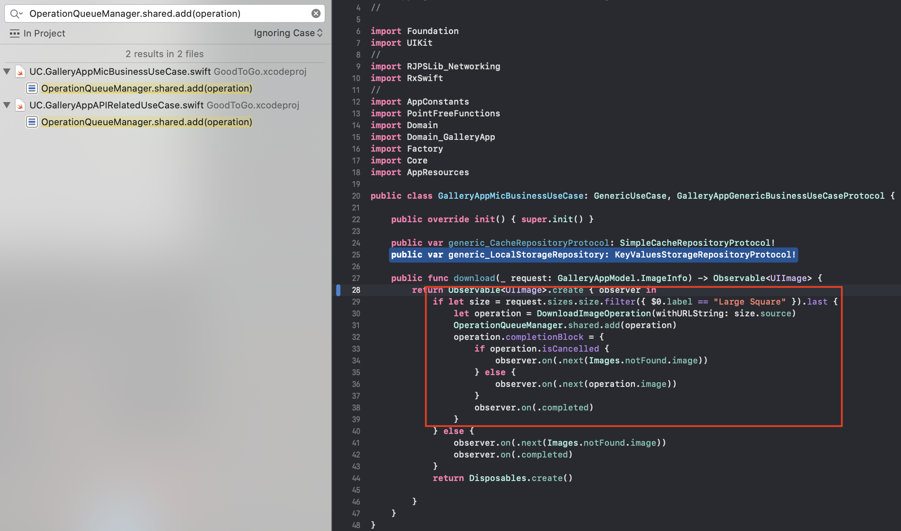
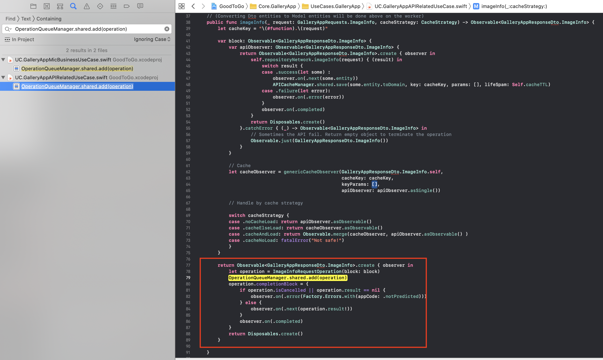
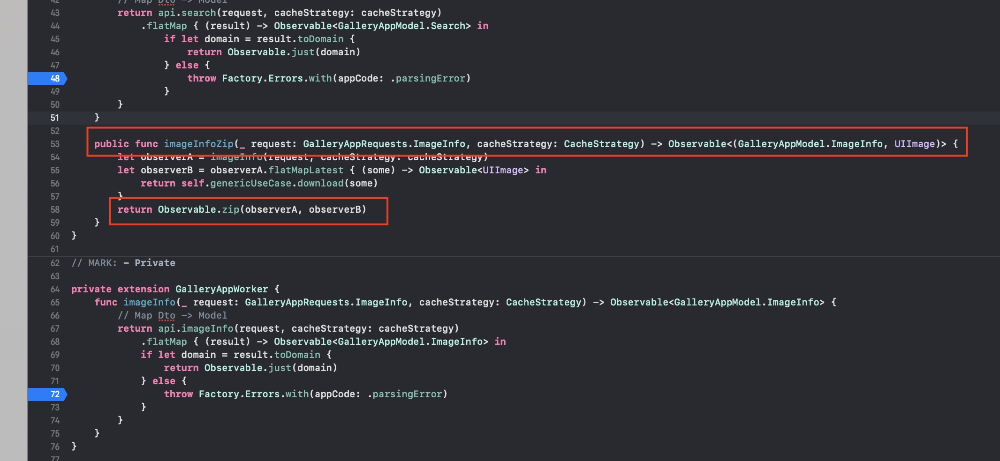

# VIP Quick Intro

The used partern was VIP, so __everything__ is separated, and so completly testable 

A single screen has allways 6 files

* `View` - View Logic
	* Only UI
	* No business
	* Foward user interation to `ViewController`
	* Dont know nothing, including `ViewController
* `UIViewController` - Display Logic
	* Glues/bridge `View` and `Interator` by observing the `View` and leting the `Interator` know about it
	* No business
	* Knows a `Router` if needed
	* Knows the `Interactor`
	* Knows `View` and observe `View` to pass events to `Interactor`
* `Interator` - Business Logic
	* Can have bussiness rules
	* Receive `ViewController` requests and do stuff with it
	* Knows `Worker` 
	* Knows `Presenter` 
	* Takes the `Worker` responses, and forward then to the `Presenter`
* `Presenter` - Presentation Logic
	* Reveives a raw object from the `Interactor` and parse it in a way that the View knows how to show it. Example : The `Interactor` can send a `Swift.Date` object to the `Presenter`, and the `Presenter` turns that into a `String` like _Monday, 10 AM_
	* Takes an `Interactor` object, parses it and sent it to the `ViewController` and the `ViewController` sends it to the `View`
* `Domain` 
	* The `Domain` file contains all the protocols related with some `Scene` (since all this layers are connected using protocols), and also all the related `ViewModels`
* `Router` 
	* Handles screen routing 

* Others	
	* `Worker` 
		* If and app could be separated into UI and business, the worker is the glue/bridge
		* Connects the Interator and the UseCases
	* `UseCases`
		* Brain of the app. 
		* Can connect to API, DataBase and so on 



# Project modules dependencies



* `GoodToGo` : Is the app it self. ViewContollers and SwiftInject related code
* `AppTheme` : Manage fonts, colors and so so
* `AppConstants` : Constantes
* `Designables` : UI components
* `Factory` : Factory for objects (for now just `Errors`)
* `AppResources` : App strings/localizables, images, etc...
* `UIBase` : Base clases, mainly for `MVP` and `VIP`
* `Domain`, `Core`, `Repositories` : DDD
* `DevTools` : Logs, feature flags, develper helping tools in general
* `Extensions` : See [Extensions](https://docs.swift.org/swift-book/LanguageGuide/Extensions.html)
* `PointFreeFunctions` : Small global var/functions like

# Used Frameworks

### Used Frameworks (Personal)

 * [RJPSLib](https://github.com/ricardopsantos/RJPSLib) - Swift toolbox - extensions, utilities, etc

### Used Frameworks (External)

 * [TinyConstraints](https://github.com/roberthein/TinyConstraints) - Nothing but sugar. (Auto layouts)
 * [Swinject](https://github.com/Swinject/Swinject) - Dependency injection framework for Swift with iOS/macOS/Linux
 * RxSwift, RxCocoa

### Moya, Alamofire??

The API was super simple, and on those case I rather not to depend on external frameworks if I cand do it easily. By doing so the final app bundle will be smaller, easy to mantain and more controlable; so no external WebAPI frameworks where used

### Images download tools?

For the challange, instead of using tools like [https://github.com/hyperoslo/Imaginary](https://github.com/hyperoslo/Imaginary) for image download, I've done my own with a caching system (uses NSCache) for fast acess, and if it fails, then tries to find the image in file system (iPhone cache folder)

```swift
public enum ImagesDownloadCachePolicy: Int {
    case none
    case cold
    case hot
    case hotOrCold
}

private static var _imagesCache = NSCache<NSString, UIImage>()
public static func downloadImageFrom(_ imageURL: String, caching: ImagesDownloadCachePolicy = .hot, completion: @escaping ((UIImage?) -> Void)) {
    func returnImage(_ image: UIImage?) {
        DispatchQueue.main.async { completion(image) }
    }
    guard let url = URL(string: imageURL) else {
        returnImage(nil)
        return
    }
    let cachedImageName = "cached_image_" + Data(imageURL.utf8).base64EncodedString().self.replacingOccurrences(of: "=", with: "") + ".png"
    if (caching == .hot || caching == .hotOrCold), let cachedImage = _imagesCache.object(forKey: cachedImageName as NSString) {
        // Try hot cache first, is faster
        returnImage(cachedImage)
        return
    } else if (caching == .cold || caching == .hotOrCold), let cachedImage = BasicNetworkClientFileManager.imageWith(name: cachedImageName) {
        returnImage(cachedImage)
        return
    } 
    
    if let data = try? Data(contentsOf: url), let image = UIImage(data: data) {
        returnImage(image)
        if caching == .cold || caching == .hotOrCold {
            _ = BasicNetworkClientFileManager.saveImageWith(name: cachedImageName, image: image)
        }
        if caching == .hot || caching == .hotOrCold {
            _imagesCache.setObject(image, forKey: cachedImageName as NSString)
        }
    }
}
```

# Used Frameworks

# Requirements done

* <strike>Must be implemented in UIKit (no SwiftUI for now)</strike>
* <strike>Grid layout (2 images per row))</strike>
* <strike>Should be memory efficient)</strike>
* <strike>Implement the necessary logic to perform the API requests for fetching the image list and image data<strike>
* <strike>Implement the necessary logic to perform the API response parsing</strike>
* <strike>Should ideally have unit tests or at least be easily testable
Language<strike>
* <strike>Main target must be written in Swift, but you can still use Objective-C dependencies<strike>
* <strike>The app should be under a git repository.</strike>
* </strike>Offline mode (use any existent images from a previous run, if no network available)<strike>
* </strike>Caching (cache response data to avoid hitting the network every time)</strike>

# Requirements NOT done

* Tap an image and open it in full screen (use the image with “Large” label).
* Certificate pinning
* Infinite scrolling

# Final notes

## Live Preview



## Not Internet suport

 

## The fun part...

So, the challange here was __dealing with a huge amout of requests at the same time__ (and iOS apps only deal with 5 or 7 at same time (dont remenber now) 

### Step1 : Use cache, not one, but 2.

To many potencial API requests, __and__ images download at same time and we needed to cut that. __I used 2 types of cache for all API requests and image download requests__ and called it _hot_ cache and _cold_ cache

__Hot cache__ uses `NSCache` behind

* Good : Super fast acess
* Bad : Only "lives" while the app is opened and the operating system lets 

__Cold cache__ uses file system behind

* Good : Live as long as we want since the TTL is as parameter. Can be 1m, 60m, 1 year and so on and since uses storage can live even after the app is closed
* Bad : Is not so fast to access as the hot cache

---


Bellow is how I try do hachieve the best performance

* The requests are cached/stored booth on _hot cache_ and _cold cache_
* When retriveing from cache, if it exists on _hot cache_ (fast access) we return it, else we retunr from the _cold clache_



### Step 2 : Qeues

Booth API requests, and images download use a `Quee` (the same), in order of we dont break the app while scrolling down and making dozen pararel requests per seconds

---

Image download queu



---

Image details API request queu



### Step 3 : Getting rigth stuff while scrolling

(I brook the VIP patter a bit here to save time and put the Cell knowing the worker and asking directly for the image. This is fixable)

The cell receives an image id, and asks the worker for the details and also the image.

Because whe do `disposeBag = DisposeBag()` on `func prepareForReuse` we dont get wring images on the wrong cell while scrolling

```swift
func setup(viewModel: VM.GalleryAppS1.TableItem) {
   set(image: Images.notFound.image)
   let request = GalleryAppRequests.ImageInfo(photoId: viewModel.id)
   self.worker?.imageInfoZip(request, cacheStrategy: .cacheElseLoad)
      .asObservable()
      .observeOn(MainScheduler.instance)
      .subscribe(onNext: { [weak self] (_, image) in
         self?.set(image: image)
      }).disposed(by: self.disposeBag)
 }

 override func prepareForReuse() {
    disposeBag = DisposeBag()
 }
```

For the `Worker` to receive and image id, asks the API for the details and then download the image, I used a Rx aproach. Do the API call, take the response and use to donwload the image, and return booth using `ZIP`

```swift
public func imageInfoZip(_ request: GalleryAppRequests.ImageInfo, cacheStrategy: CacheStrategy) -> Observable<(GalleryAppModel.ImageInfo, UIImage)> {
  let observerA = imageInfo(request, cacheStrategy: cacheStrategy)
  let observerB = observerA.flatMapLatest { (some) -> Observable<UIImage> in
    return self.genericUseCase.download(some)
  }
  return Observable.zip(observerA, observerB)
}
```
    
